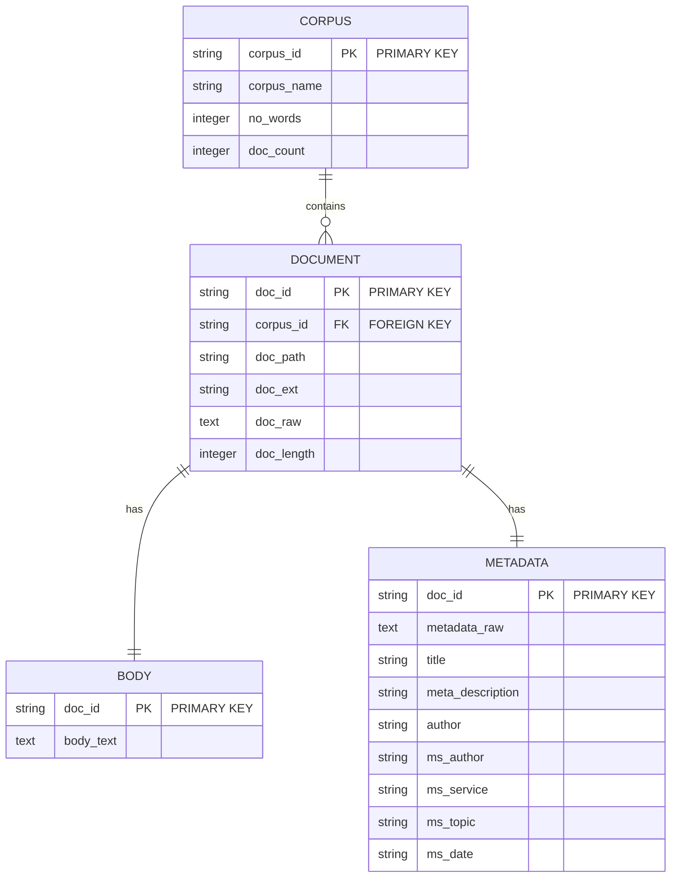

# Source corpus

Text Miner uses a corpus collected into a SQLite database from text or markdown files using the [Text Collector](https://github.com/mattbriggs/text-collector) project.

The following entity-relationship diagram illustrates the tables and their relationships in the database produced by the Text Collector project.

## Corpus model

## Corpus SQL

- **Entities** are represented as blocks (`CORPUS`, `DOCUMENT`, `BODY`, `METADATA`), with each entity listing its fields. Each field's type is indicated (e.g., `string`, `text`, `integer`).
- **Primary Keys** (PK) and **Foreign Keys** (FK) are annotated next to the respective fields.
- The relationships are denoted with lines and symbols where:
  - `||` indicates a one (1) and `{` indicates many (M), reflecting the cardinality of the relationship.
  - `||--o{`: One to many relationship (e.g., one corpus can contain many documents).
  - `||--||`: One to one relationship (e.g., one document has one body and one metadata set).

## Related content

[Text miner](../README.md)