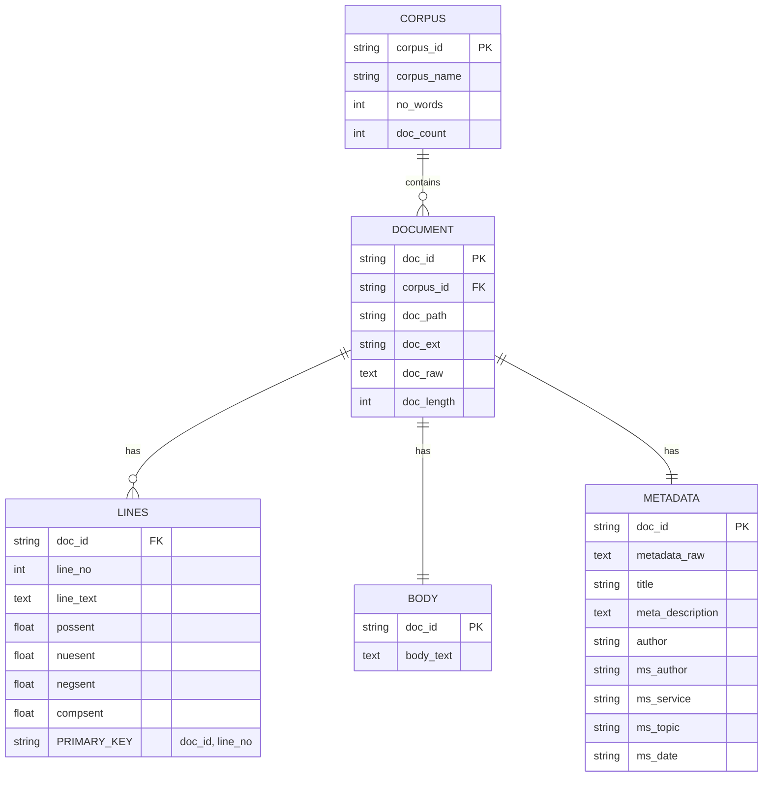

# Source corpus

Text Miner uses a corpus collected into a SQLite database from text or markdown files using the [Text Collector](https://github.com/mattbriggs/text-collector) project.

The following entity-relationship diagram illustrates the tables and their relationships in the database produced by the Text Collector project.

## Corpus model

The following ERD (Entity Relationship Diagram) shows the structure of the database:

### Explanation of the ERD

1. **Corpus Table**:
   - Each `corpus` entry can have multiple `documents`, representing a collection of documents.
   - The table `corpus` has attributes like the name of the corpus, number of words, and document count.

2. **Document Table**:
   - Each `document` is linked to one `corpus` through the `corpus_id`.
   - A `document` can have multiple `lines` and exactly one `body` and one `metadata` entry.
   - This table includes details such as document path, extension, raw content, and length.

3. **Lines Table**:
   - The `lines` table stores each line of a document as a separate record with sentiment scores.
   - It has a composite primary key consisting of `doc_id` and `line_no`, ensuring each line in a document is uniquely identified.
   - Each line has sentiment anlaysis 0-1 for:
      - Positive sentiment (possent)
      - Neutral sentiment (nuesent)
      - Negative sentiment (negsent)
      - Composite sentiment (compsent)

4. **Body Table**:
   - The `body` table contains the main text of a document.
   - It is directly linked to the `document` table and identified by the `doc_id`.

5. **Metadata Table**:
   - This table contains metadata about a document such as the raw metadata, title, description, and author information.
   - Similar to the `body` table, each `metadata` entry is uniquely identified by `doc_id`.

This ERD showcases the relationships and key attributes of your database, essential for understanding how data is interconnected within your schema.

## Related content

[Text miner](../README.md)